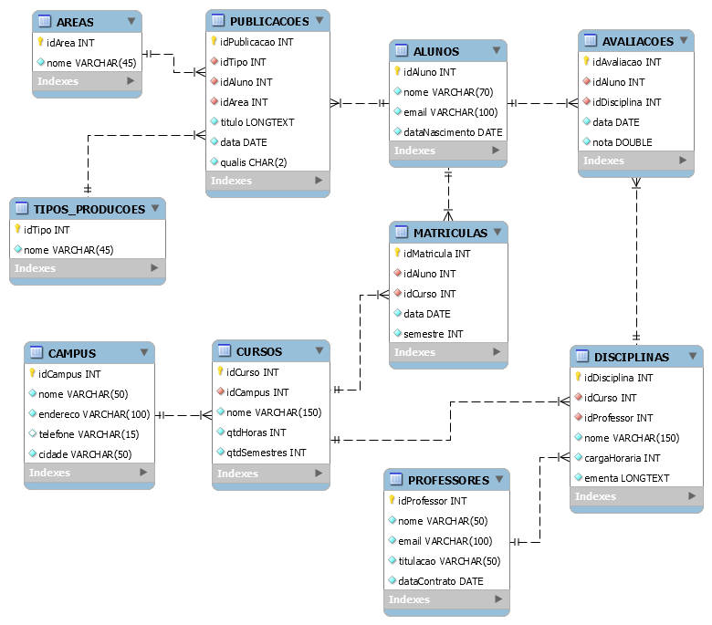

 


# Banco de Dados BD_UNIVERSIDADE

Este repositório contém o script SQL para a criação do banco de dados *BD_UNIVERSIDADE*, que gerencia informações de alunos, cursos, professores, matrículas, disciplinas, avaliações e publicações acadêmicas. Veja a seguir as instruções para importação dos scripts no `MySQL Workbench` e na sequência como esse banco de dados está estruturado.

---

## Instruções para Importar o Arquivo `bd_universidade.sql` no MySQL Workbench

Este tutorial descreve como importar o arquivo SQL para configurar o banco de dados **BD_UNIVERSIDADE** no MySQL Workbench.

### Pré-requisitos:
- MySQL Workbench instalado em sua máquina.
- MySQL Server em execução.
- O arquivo `bd_universidade.sql` localizado no seu computador.

### Passos para a Importação:

#### 1. Abrir o MySQL Workbench
- Inicie o **MySQL Workbench**.
- Conecte-se ao seu servidor MySQL clicando na conexão desejada.

#### 2. Importar o Arquivo SQL
- No menu superior, clique em **File**.
- Selecione **Open SQL Script**.
- Navegue até o local onde o arquivo `bd_universidade.sql` está salvo e selecione-o.
- O conteúdo do arquivo SQL será exibido na janela do editor de scripts.

#### 3. Executar o Script SQL
- Para executar o script:
  - Clique no ícone de raio (**Execute**), ou pressione **Ctrl + Shift + Enter**.
- O MySQL Workbench processará o script SQL, criará o banco de dados **bd_universidade**, as tabelas, e inserirá os dados.

#### 4. Verificar a Importação
- Após a execução bem-sucedida, navegue até o painel **Schemas** e localize o banco de dados **bd_universidade**.
- Expanda o banco de dados para verificar se todas as tabelas foram criadas corretamente e se os dados foram importados.

### Comando Alternativo (linha de comando):
Caso prefira realizar a importação via linha de comando, você pode usar o seguinte comando no terminal:

```bash
mysql -u root -p < caminho/para/bd_universidade.sql
```

---

## Estrutura do Banco de Dados

### Diagrama Entidade-Relacionamento



---

### 1. Tabela `ALUNOS`
Armazena as informações dos alunos da universidade.

#### Atributos:
- `idAluno` (INT, PK): Identificador único de cada aluno.
- `nome` (VARCHAR(70)): Nome completo do aluno.
- `email` (VARCHAR(100)): E-mail do aluno.
- `dataNascimento` (DATE): Data de nascimento do aluno.

#### Quantidade de Registros:
- `10.000` registros

#### Exemplo de Registros:
| idAluno | nome                                    | email                         | dataNascimento |
|---------|-----------------------------------------|-------------------------------|----------------|
| 1       | ADEVAL VEIGA DOS SANTOS                 | ADEVAL_SANTOS01@BD.COM         | 1997-08-14     |
| 2       | SERGIO HENRIQUE GONCALVES HONORIO       | SERGIO_HONORIO02@BD.COM        | 1998-02-09     |
| 3       | RAFAEL FORMOLO                          | RAFAEL_FORMOLO03@BD.COM        | 1995-03-24     |

---

### 2. Tabela `CAMPUS`
Armazena as informações dos campus da universidade.

#### Atributos:
- `idCampus` (INT, PK): Identificador único para cada campus.
- `nome` (VARCHAR(50)): Nome do campus.
- `endereco` (VARCHAR(100)): Endereço completo do campus.
- `telefone` (VARCHAR(15)): Telefone do campus (pode ser nulo).
- `cidade` (VARCHAR(50)): Cidade onde o campus está localizado.

#### Quantidade de Registros:
- `15` registros

#### Exemplo de Registros:
| idCampus | nome                      | endereco                                                        | telefone       | cidade  |
|----------|---------------------------|------------------------------------------------------------------|----------------|---------|
| 1        | Câmpus Visconde da Graça   | Av. Ildelfonso Simões Lopes, 2791 - Pelotas/RS                   | (53) 3309-5550 | Pelotas |
| 2        | Câmpus Pelotas             | Praça Vinte de Setembro, 455 - Pelotas/RS                        | (53) 2123-1000 | Pelotas |
| 3        | Câmpus Bagé                | Av. Leonel de Moura Brizola, 2501 - Bagé/RS                      | (53) 3247-3237 | Bagé    |

---

### 3. Tabela `CURSOS`
Armazena os cursos oferecidos nos diferentes campus.

#### Atributos:
- `idCurso` (INT, PK): Identificador único para cada curso.
- `idCampus` (INT, FK): Referência ao campus onde o curso é oferecido.
- `nome` (VARCHAR(150)): Nome do curso.
- `qtdHoras` (INT): Carga horária total do curso.
- `qtdSemestres` (INT): Duração do curso em semestres.

#### Quantidade de Registros:
- `174` registros

#### Exemplo de Registros:
| idCurso | nome                                                                 | qtdHoras | qtdSemestres | idCampus |
|---------|----------------------------------------------------------------------|----------|--------------|----------|
| 1       | Multimeios Didáticos (Subsequente \| Distância)                       | 2600     | 6            | 5        |
| 2       | Educação: Espaços e Possibilidades para Educação Continuada (Especialização \| Distância) | 2600 | 6        | 2        |
| 3       | Práticas de Ensino: Educar pela Pesquisa (Especialização \| Presencial) | 2600    | 6           | 4        |

---

### 4. Tabela `MATRICULAS`
Armazena as matrículas dos alunos nos cursos.

#### Atributos:
- `idMatricula` (INT, PK): Identificador único de cada matrícula.
- `idAluno` (INT, FK): Referência ao aluno que realizou a matrícula.
- `idCurso` (INT, FK): Referência ao curso no qual o aluno se matriculou.
- `data` (DATE): Data de realização da matrícula.
- `semestre` (INT): Semestre em que o aluno está matriculado.

#### Quantidade de Registros:
- `10.000` registros

#### Exemplo de Registros:
| idMatricula | idAluno | idCurso | data        | semestre |
|-------------|---------|---------|-------------|----------|
| 53          | 7090    | 109     | 2016-11-13  | 2        |
| 465         | 19      | 114     | 2019-02-28  | 2        |
| 486         | 7653    | 92      | 2017-04-24  | 4        |

---

### 5. Tabela `PROFESSORES`
Armazena os dados dos professores da universidade.

#### Atributos:
- `idProfessor` (INT, PK): Identificador único para cada professor.
- `nome` (VARCHAR(70)): Nome completo do professor.
- `email` (VARCHAR(100)): E-mail de contato.
- `titulacao` (VARCHAR(50)): Titulação do professor.
- `dataContrato` (DATE): Data de contratação.

#### Quantidade de Registros:
- `2.420` registros

#### Exemplo de Registros:
| idProfessor | nome                                             | email                            | titulacao | dataContrato |
|-------------|--------------------------------------------------|----------------------------------|-----------|--------------|
| 1           | CAROLINE ALMEIDA FRANCA                          | CAROLINE_FRANCA10001@BD.COM      | Mestre    | 2017-04-13   |
| 2           | MARIA HELENA DAS GRACAS VASCONCELOS DE SOUZA GUIMARAES | MARIA_GUIMARAES10002@BD.COM      | Mestre    | 2018-05-11   |
| 3           | MILENA BARBOSA DE MEDEIROS                       | MILENA_MEDEIROS10003@BD.COM      | Doutor    | 2012-09-23   |

---

### 6. Tabela `DISCIPLINAS`
Armazena as disciplinas ofertadas nos cursos, ministradas pelos professores.

#### Atributos:
- `idDisciplina` (INT, PK): Identificador único de cada disciplina.
- `idCurso` (INT, FK): Referência ao curso em que a disciplina é ofertada.
- `idProfessor` (INT, FK): Referência ao professor responsável pela disciplina.
- `nome` (VARCHAR(150)): Nome da disciplina.
- `cargaHoraria` (INT): Carga horária da disciplina.
- `ementa` (LONGTEXT): Ementa descritiva da disciplina.

#### Quantidade de Registros:
- `1.281` registros

#### Exemplo de Registros:
| idDisciplina | nome                            | cargaHoraria | idCurso | idProfessor |
|--------------|---------------------------------|--------------|---------|-------------|
| 1            | Finanças e Orçamentos           | 90           | 15      | 1           |
| 2            | Materiais, Produção e Logística | 90           | 15      | 2           |
| 3            | Mercado e Marketing             | 90           | 15      | 3           |

---

### 7. Tabela `AVALIACOES`
Armazena as avaliações realizadas pelos alunos em cada disciplina.

#### Atributos:
- `idAvaliacao` (INT, PK): Identificador único de cada avaliação.
- `idAluno` (INT, FK): Referência ao aluno que realizou a avaliação.
- `idDisciplina` (INT, FK): Referência à disciplina da avaliação.
- `data` (DATE): Data de realização da avaliação.
- `nota` (DOUBLE): Nota obtida pelo aluno.

#### Quantidade de Registros:
- `269.750` registros

#### Exemplo de Registros:
| idAvaliacao | idAluno | idDisciplina | data        | nota |
|-------------|---------|--------------|-------------|------|
| 1           | 532     | 205          | 2020-01-07  | 7.26 |
| 49996       | 3731    | 405          | 2017-06-16  | 6.93 |
| 75007       | 8368    | 646          | 2017-09-03  | 10.00 |

---

### 8. Tabela `TIPOS_PRODUCOES`
Armazena os diferentes tipos de produções acadêmicas (artigos, livros, etc.).

#### Atributos:
- `idTipo` (INT, PK): Identificador único para cada tipo de produção acadêmica.
- `nome` (VARCHAR(45)): Nome do tipo de produção acadêmica.

#### Quantidade de Registros:
- `12` registros

#### Exemplo de Registros:
| idTipo | nome              |
|--------|-------------------|
| 1      | Artigo Científico |
| 2      | Artigo de Revisão |
| 3      | Resenha Crítica   |

---

### 9. Tabela `AREAS`
Armazena as diferentes áreas de conhecimento relacionadas às produções acadêmicas.

#### Atributos:
- `idArea` (INT, PK): Identificador único para cada área de conhecimento.
- `nome` (VARCHAR(45)): Nome da área de conhecimento.

#### Quantidade de Registros:
- `8` registros

#### Exemplo de Registros:
| idArea | nome                       |
|--------|----------------------------|
| 1      | Ciências Exatas e da Terra |
| 2      | Ciências Biológicas         |
| 3      | Engenharias                |

---

### 10. Tabela `PUBLICACOES`
Armazena as publicações feitas pelos alunos em diferentes áreas e tipos.

#### Atributos:
- `idPublicacao` (INT, PK): Identificador único para cada publicação.
- `idTipo` (INT, FK): Referência ao tipo de produção.
- `idAluno` (INT, FK): Referência ao aluno autor da publicação.
- `idArea` (INT, FK): Referência à área de conhecimento da publicação.
- `titulo` (LONGTEXT): Título da publicação.
- `data` (DATE): Data de publicação.
- `qualis` (CHAR(2)): Classificação Qualis da publicação.

#### Quantidade de Registros:
- `1.461` registros

#### Exemplo de Registros:
| idPublicacao | titulo                                                                                      | data        | qualis | idTipo | idAluno | idArea |
|--------------|----------------------------------------------------------------------------------------------|-------------|--------|--------|---------|--------|
| 1            | Construção de uma Estratégia Eficiente de Escalonamento de Threads em Arquiteturas Multicore | 2017-04-02  | A3     | 1      | 8073    | 1      |
| 2            | Análise de Consumo e Desempenho em Processadores ARM                                          | 2019-02-06  | A2     | 1      | 689     | 1      |
| 3            | Uma análise da eficiência das estratégias de algoritmos de escalonamento em arquiteturas híbridas | 2019-11-24  | B2     | 1      | 8950    | 1      |

---

